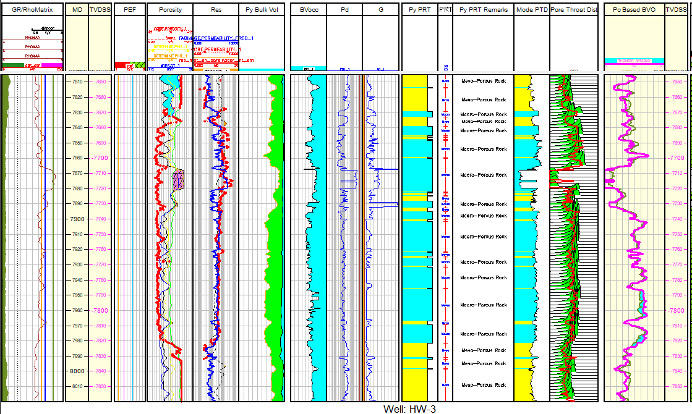
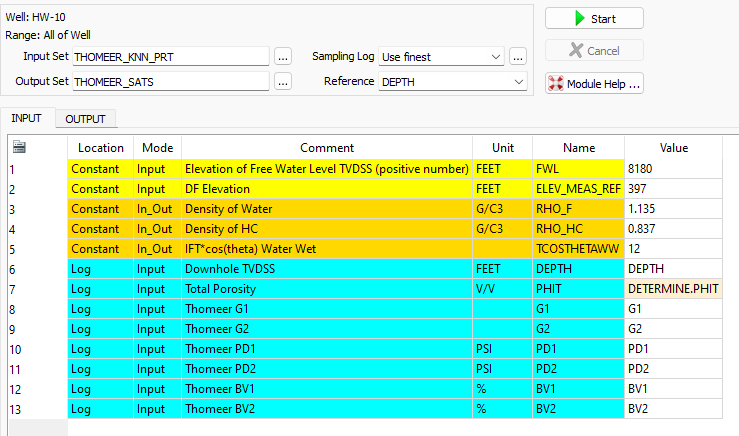
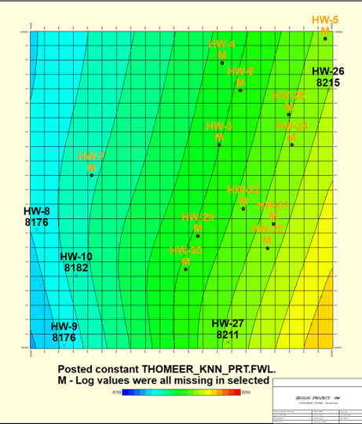

# Characterization-of-a-New-Open-Source-Carbonate-Reservoir-Benchmarking-Case-Study-by-Costa
We have used the new hierarchical carbonate reservoir benchmarking case study created by Costa Gomes J, Geiger S, Arnold D to be used for reservoir characterization, uncertainty quantification and history matching. 

## According to Costa(1):
> *This work presents a new open-source carbonate reservoir case study, the COSTA model, that uniquely considers significant uncertainties inherent to carbonate reservoirs, providing a far more challenging and realistic benchmarking test for a range of geo-energy applications. The COSTA field is large, with many wells and large associated volumes. The dataset embeds many interacting geological and petrophysical uncertainties in an ensemble of model concepts with realistic geological and model complexity levels and varying production profiles. The resulting number of different models and long run times creates a more demanding computational challenge than current benchmarking models.*

> *The COSTA model takes inspiration from the shelf-to-basin geological setting of the Upper Kharaib Member (Early Cretaceous), one of the most prolific aggradational parasequence carbonate formations sets in the world. The dataset is based on 43 wells and the corresponding fully anonymised data from the north-eastern part of the Rub Al Khali basin, a sub-basin of the wider Arabian Basin. Our model encapsulates the large-scale geological setting and reservoir heterogeneities found across the shelf-to-basin profile, into one single model, for geological modelling and reservoir simulation studies.*

> *The result of this research is a semi-synthetic but geologically realistic suite of carbonate reservoir models that capture a wide range of geological, petrophysical, and geomodelling uncertainties and that can be history-matched against an undisclosed, synthetic 'truth case'. The models and dataset are made available as open-source to analyse several issues related to testing new numerical algorithms for geological modelling, uncertainty quantification, reservoir simulation, history matching, optimisation and machine learning.*

# VERY ROUGH DRAFT, and not for public use at this time

In this repository we have used this new comprehensive reservoir characterization database including well available well logs, Routine Core Analysis (RCA) and Special Core Analysis (SCAL) to test our standard carbonate reservoir characterization workflow. We have not been able to employ the 3D static and dymanic models, but we did use the time series dynamic data including production and formation pressures as created by Costa, Geiger and Arnold. This is a rich dataset that needs to be explored futher than what is presented in the scope of this repository. We used all core RCA and SCAL core data as well as the 17 well logs. We also used Spotfire to supplement the dynamic data in our Petrophysical Characterization of this carbonate reservoir. We will in the near future include all of these data in a Geolog project with Geolog python loglans used in the characterization.

The process used in this repository follows tried and proven workflow as described by Phillips et al.(2) used in the characterization of an Arab D carbonate carbonate reservoirs from Saudi Arabia. Core Porosity, Permeability, Petrophysical Rock Types (PRT), Capillary Pressure and modeled saturations are all estimated or calculated within this workflow in order to characterize this reservoir. Costa's core analysis database is used extensively as the calibration data to this characterization. 

Costa provided 110 High Pressure Mercury Injection (HPMI) core samples with RCA Porosity and Permeability that were used to establish our own, reservoir specific Thomeer Parameter Capillary Pressure core database. We fit the Thomeer hyperbola to all HPMI samples, and establish the Thomeer parameters for each sample. We use Geolog python loglan code to load High Pressure Mercury Injection (HPMI) Core data directly from the Costa SCAL dataset in the Geolog Well and then model the HPMI data using the Thomeer parameters used to fit the Thomeer hyperbola to the HPMI data. This portion of the Geolog project serves as great example for the user to build their own reservoir-specific core calibration database for their own Reservoir Characterization studies. 

### Suggested Carbonate Workflow:
The following workflow and processing is suggested to interrogate, process, interpret and model the petrophysical properties for this benchmark carbonate reservoir using Costa's High Pressure Mercury Injection core database as calibration. The workflow consists of the following steps:

1) Interrogate the Well Log data and Costa calibration data using standard Geolog layouts, cross plots and histograms and then use a python loglan featuring Altair, which is interactive software driven from a Geolog Module Launcher.

##### Altair used to Interrogate the Costa Capillary Pressure curves and Petrophysical Rock Types (PRTs):

2) Normally we would run MultiMin for a solid log analysis model using the typical minerals found in thia reservoir; Limestone, Dolomite, and Illite. With MultiMin we always use environmentally corrected log data and use the calculated uncertainties for each log curve employed in the analysis. However, to make this dataset more universal, we have employeed python to perform our determinstic log analyis of the 17 HW wells. We received these data as las files with a file of log header data inlcuiding X,Y locations, KB elevation and TD. 

3) Use available core data from the representative reservoir/field to build a petrophysical model to estimate permeability for all wells in field using Geolog's Facimage. Our ploan is to include a python loglan using kNN with normalized input data, weighted by Euclidean distances for each of the nearest neighbors to estimate permeability for each well. 

4) Using the kNN estimated permeability and calculated Total Porosity (PHIT) from MultiMin, we queryied Costa's core database to predict the following Petrophysical results:
    - Thomeer Capillary Pressure parameters (Pdi, Gi and BVocci) for each pore system i over the reservoir interval
    - Estimate the most dominant pore throat diameter at each level in the well calculated from the Thomeer parameters G and Pd. 

5) Use the Thomeer Capillary Pressure parameters to model saturations based on the buoyancy due to fluid density differences at the height above the Free Water Level (FWL). In this instance we compare the Bulk Volume Oil (BVO) from our analysis vs. BVO from Thomeer-based capillary pressure saturations, We use BVO since BVO is pore volume weighted.

We did perform a Free Water Level (FWL) seach for each well. 

This is an example of the output from a typical FWL search:

Not all wells are useful in establishing the FWL. A few of the wells were too high and all we really were estimating was the Base of Reservoir(BOR) for those wells. There were also a few wells that were near 100% wet, and they were not used to establish the FWL surface. Eliminatiing these wells allowed us to establish the following FWL surface for this reservoir:

This FWL Surface was then used with the estimated Thomeer parameters for each well to calculate Capillary Pressure based saturations for each well:

### RESOURCES:
https://researchportal.hw.ac.uk/en/datasets/costa-model-hierarchical-carbonate-reservoir-benchmarking-case-st

https://github.com/Philliec459?tab=repositories

1. Costa Gomes J, Geiger S, Arnold D. The Design of an Open-Source Carbonate Reservoir Model. Petroleum Geoscience, 
    https://doi.org/10.1144/petgeo2021-067
3.	Phillips, E. C., Buiting, J. M., Clerke, E. A, “Full Pore System Petrophysical Characterization Technology for Complex Carbonate Reservoirs – Results from Saudi Arabia”, AAPG, 2009 Extended Abstract.
4.	Clerke, E. A., Mueller III, H. W., Phillips, E. C., Eyvazzadeh, R. Y., Jones, D. H., Ramamoorthy, R., Srivastava, A., (2008) “Application of Thomeer Hyperbolas to decode the pore systems, facies and reservoir properties of the Upper Jurassic Arab D Limestone, Ghawar field, Saudi Arabia: A Rosetta Stone approach”, GeoArabia, Vol. 13, No. 4, p. 113-160, October, 2008. 
 
